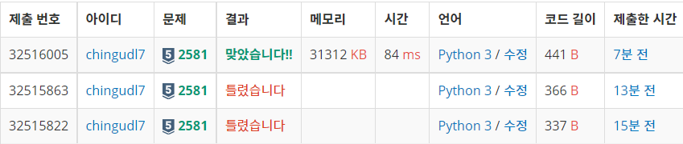

 


[URL] : <https://www.acmicpc.net/problem/2581>


## 문제


## 풀이

```python
import math

m = int(input())
n = int(input()) 

# m 이상 n 이하의 소수의 합 + 최솟값
p = []

def is_prime_num(n):
	if n == 0 or n == 1:
		return False
	elif n == 2:
		return True
	else:
		for i in range(2, int(math.sqrt(n)) + 1):
			if n % i == 0:
				return False
	return True

for i in range(m, n+1):
	if is_prime_num(i) is True:
		p.append(i)

if not p:
	print(-1)
else:
	print(sum(p))
	print(min(p))
```


## 알게된 점




비교적 간단한 문제였다. 틀린 이유.

1. 문제를 제대로 읽지 않았다

   M 이상 N이하의 자연수 중 소수가 없을 경우 첫째 줄에 -1을 출력한다는 문구를 간과했다. 앞으로는 문제 주의 사항을 잘 읽자.

2. 소수 확인시 0~2의 수를 고려해주지 않았다

   입력으로 들어올 수 있는 모든 수에 대해 고려하자.


