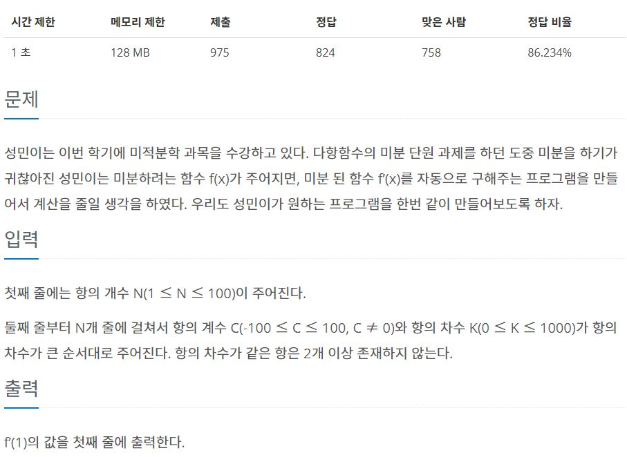

[URL] : <https://www.acmicpc.net/problem/14730>


## 문제




## 풀이

```python
# 항의 개수 n
n = int(input())
f = []
for _ in range(n):
	# 항의 계수 c, 항의 차수 k
	c, k = map(int, input().split())
	f.append([c, k])
# f'(1)
result = 0
for i in f:
	result += i[0]*i[1]
print(result)
```


### ***

f'(1)값을 구해야 해서 항의 계수와 항의 차수를 각각 곱해 더하기만 하면 된다.
비교적 간단하게 구현할 수 있었다


