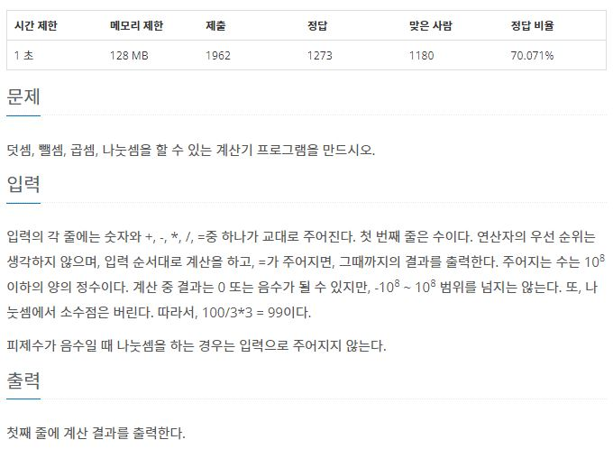

[URL] : <https://www.acmicpc.net/problem/5613>


## 문제




## 풀이

```python
result = 0
a = int(input())	# 첫 입력 숫자
result = a
while True:
	b = input()
	if b == '=':
		break
	a = int(input())
	if b == '+':
		result += a
	elif b == '-':
		result -= a
	elif b == '*':
		result *= a
	elif b == '/':
		result //= a

print(result)
```


### ***

첫 입력 숫자를 따로 result 값에 받은 후, while문을 돌려서 연산자 '=' 가 나올 때까지 계산하도록 작성했다


